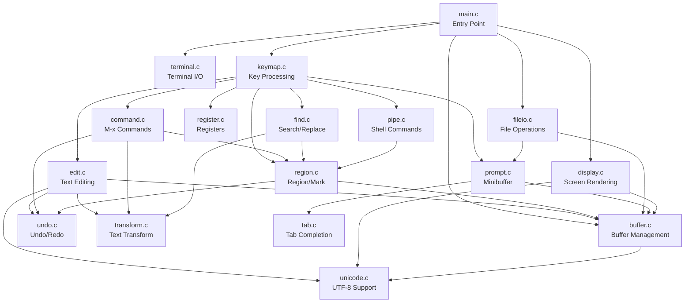

```mermaid
graph TB
    main[main.c<br/>Entry Point] --> terminal[terminal.c<br/>Terminal I/O]
    main --> display[display.c<br/>Screen Rendering]
    main --> keymap[keymap.c<br/>Key Processing]
    main --> buffer[buffer.c<br/>Buffer Management]
    main --> fileio[fileio.c<br/>File Operations]
    
    keymap --> edit[edit.c<br/>Text Editing]
    keymap --> command[command.c<br/>M-x Commands]
    keymap --> region[region.c<br/>Region/Mark]
    keymap --> register[register.c<br/>Registers]
    keymap --> find[find.c<br/>Search/Replace]
    keymap --> pipe[pipe.c<br/>Shell Commands]
    keymap --> prompt[prompt.c<br/>Minibuffer]
    
    edit --> buffer
    edit --> undo[undo.c<br/>Undo/Redo]
    edit --> transform[transform.c<br/>Text Transform]
    edit --> unicode[unicode.c<br/>UTF-8 Support]
    
    command --> region
    command --> transform
    command --> undo
    
    region --> buffer
    region --> undo
    
    find --> region
    find --> transform
    
    pipe --> region
    
    fileio --> buffer
    fileio --> prompt
    
    prompt --> buffer
    prompt --> tab[tab.c<br/>Tab Completion]
    
    display --> buffer
    display --> unicode
    
    buffer --> unicode
```
